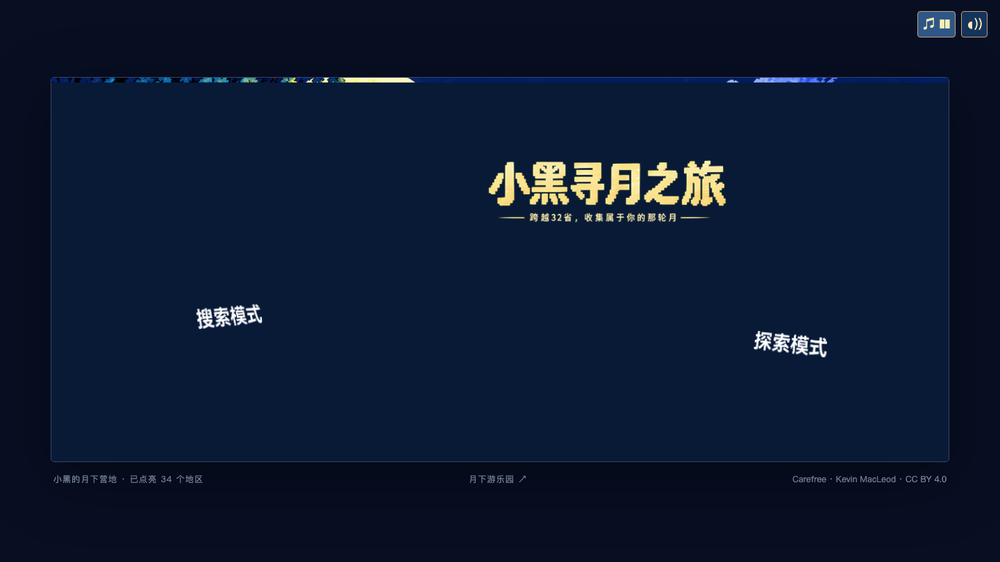
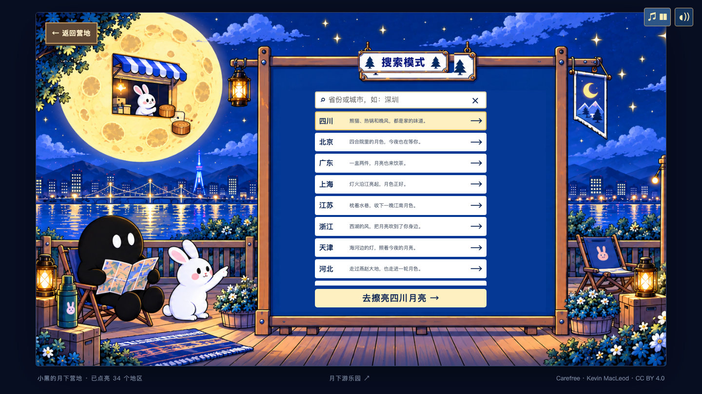
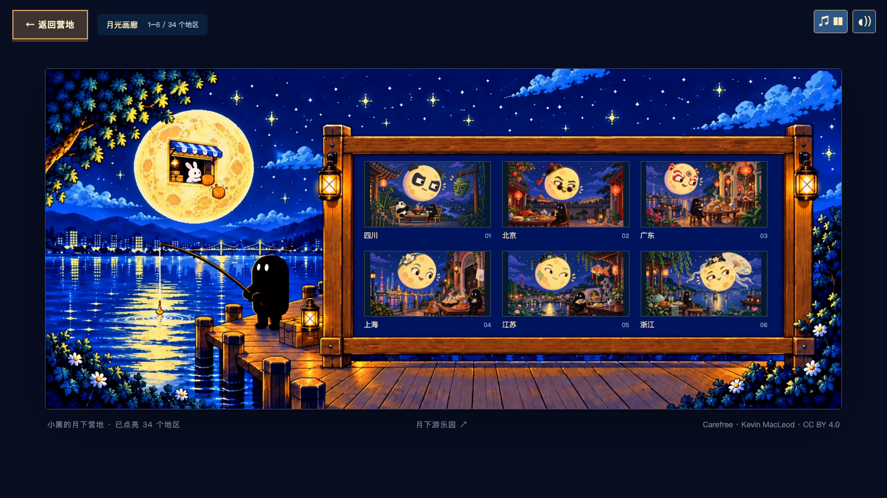
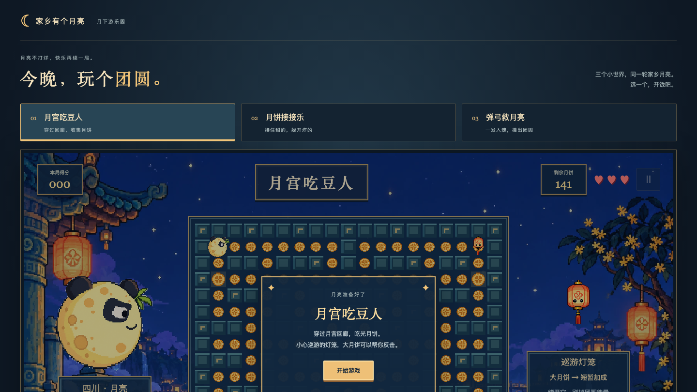

# 家乡有个月亮 · 小黑的月下营地

> 陪小黑找一轮家乡的月亮 —— 一个跨越 32 省、收集属于你的那轮月的互动像素风网页。

**在线访问**：<https://adgaiiiiilllll-code.github.io/moon-hometown/>

## 这是什么

一幅 21:9 的月下画卷。小黑在月下营地等你，一起用三种方式寻找家乡的月色：

| 页面 | 玩法 |
|---|---|
| 🏕️ 月下营地（主页） | 点击「搜索模式」或「探索模式」招牌进入不同玩法 |
| 🔍 搜索模式 | 输入省份或城市，找到想念的那轮家乡月亮 |
| 🎁 探索模式 | 拆开月兔的盲盒，随机遇见一轮神秘月色 |
| 🌌 月色揭晓 | 按住鼠标或手指擦亮夜空，唤醒属于你的像素月色 |
| 🖼️ 月光画廊 | 欣赏并保存全部 34 个地区的月色收藏 |
| 🕹️ 月下游乐园 | 三款小游戏：月宫吃豆人、月饼接接乐、弹弓救月亮 |

## 截图

| 主页 | 探索页（月兔盲盒铺） |
|---|---|
|  |  |

| 搜索页 | 月光画廊 |
|---|---|
|  |  |

| 月色揭晓 | 月下游乐园 |
|---|---|
|  |  |

## 技术说明

- 纯静态站点：原生 HTML / CSS / JavaScript（ES Modules），无需构建
- 像素月色资产 34 个地区，全部本地加载
- 背景音乐：*Carefree* · Kevin MacLeod（CC BY 4.0）
- 手机端建议横屏体验；桌面端为全景 21:9 视图

## 本地运行

```bash
python3 -m http.server 8000
# 打开 http://localhost:8000
```

---
像素月色 · 简单快乐 🌙
